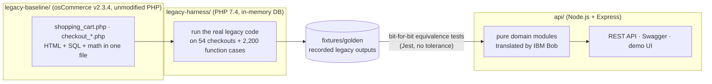

# CleanCart: modernizing osCommerce with IBM Bob

I used Bob to modernize osCommerce's tangled legacy checkout module. I extracted its core pricing logic
and turned it into a secure, decoupled Node.js REST API with automated test coverage, showing how AI can
help modernize mission-critical legacy systems safely and efficiently.

**Live demo:** [cleancart-api.onrender.com](https://cleancart-api.onrender.com) · [Swagger UI](https://cleancart-api.onrender.com/docs/) · [live equivalence report](https://cleancart-api.onrender.com/api/v1/equivalence)

## The idea in one picture



1. **Baseline:** the untouched osCommerce v2.3.4 source lives in [`legacy-baseline/`](legacy-baseline/SOURCE.md).
2. **Ground truth:** [`legacy-harness/`](legacy-harness/README.md) runs that PHP for real (PHP 7.4, no MySQL
   needed) and records every intermediate value of 54 checkouts plus ~2,200 direct function calls into
   [`fixtures/golden/`](fixtures/README.md).
3. **AI modernization:** IBM Bob analyzes the PHP, documents its business rules and quirks, writes baseline
   tests, and translates the logic into pure JavaScript modules, one module at a time
   ([`BOB_TASKS.md`](BOB_TASKS.md)).
4. **Proof:** every golden value must be reproduced **exactly**, with no tolerance, including 10 documented
   legacy quirks. A fresh random hold-out set from the PHP blocks memorised answers.
5. **API:** stateless REST endpoints with validation, Swagger docs and a demo UI that shows the legacy and
   modern results side by side.

## Repository map

| Path | What |
|---|---|
| `legacy-baseline/` | osCommerce v2.3.4 source, unmodified (the "before") |
| `legacy-harness/` | Runs the legacy PHP: fake DB, page-flow runner, PHPUnit characterization tests |
| `fixtures/` | Demo catalog + golden legacy outputs (generated, never hand-edited) |
| `api/src/domain/` | Pure business logic: tax, rounding, currency, cart, order, shipping, order totals |
| `api/src/http/` | Express app, routes, zod validation, error handling |
| `api/src/verify/` | Equivalence checks shared by the tests, `npm run status` and `/api/v1/equivalence` |
| `api/test/` | Jest: equivalence (golden), API, infrastructure, and unit tests |
| `api/public/` | Demo UI (served at `/`) |
| `docs/` | Plan, business rules, quirks, architecture (legacy and modern), Bob session logs |
| `BOB_TASKS.md`, `AGENTS.md`, `.bob/` | The IBM Bob playbook, agent rules and project modes |

## Run it locally

Requires Node.js 20+ (24 recommended). **No PHP, MySQL or Docker needed.**

```bash
npm install
npm test            # protected-files check + all Jest suites
npm start           # http://localhost:3000  (UI)  ·  /docs (Swagger)  ·  /api/v1/equivalence
```

More commands:

```bash
npm run status          # translation progress per module
npm run verify          # the full gate: protected files, lint, integrity, docs, tests, 100% domain coverage
npm run legacy:test     # PHPUnit against the real legacy PHP (both tax display modes)
npm run golden:verify   # re-run the PHP and confirm the committed fixtures byte-for-byte
npm run holdout         # fresh random legacy cases → equivalence check (anti-overfitting)
```

## API at a glance

| Method | Path | Legacy equivalent |
|---|---|---|
| `POST` | `/api/v1/tax/rate` | `tep_get_tax_rate()` + `tep_get_tax_description()` |
| `POST` | `/api/v1/cart/calculate` | `shoppingCart::calculate()` (the cart page) |
| `POST` | `/api/v1/checkout/totals` | `checkout_shipping.php` → `checkout_confirmation.php`: order, shipping, `ot_*` modules |
| `GET` | `/api/v1/products`, `/api/v1/reference` | catalog and reference data |
| `GET` | `/api/v1/scenarios/{name}/compare` | one golden checkout, legacy vs. modern |
| `GET` | `/api/v1/equivalence` | every golden case re-checked live |

## How IBM Bob was used

See [`BOB_TASKS.md`](BOB_TASKS.md) for the 11 tasks and exact prompts, and
[`docs/bob-sessions/`](docs/bob-sessions/) for the transcripts. Bob works in four project modes
([`.bob/custom_modes.yaml`](.bob/custom_modes.yaml)). Each mode can only edit the files of its task, and
everything else is protected by a SHA-256 manifest checked in CI.

## Maintainers

Protected files (everything Bob may not edit) are recorded in `scripts/protected.sha256`. After an
intentional change to one of them, for example adding the live URL to this README, run
`npm run protect:update` and commit the manifest.

## License

GPL-2.0, like osCommerce itself (the API is a translation of GPL code). See [`LICENSE`](LICENSE).
