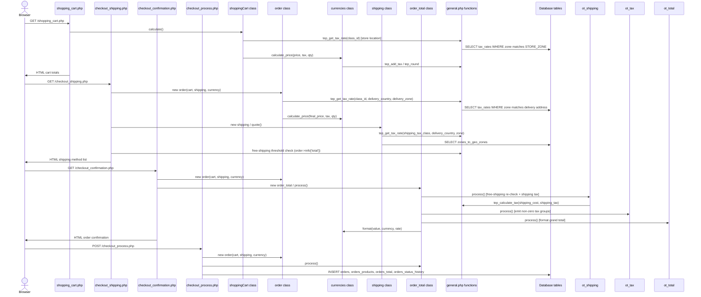

# Legacy architecture: osCommerce v2.3.4 checkout

<!-- Filled in by Bob (T1). Keep all headings, ids, "Legacy" and "Golden evidence" lines.
     Check with: npm run check:docs -- --stage analysis -->

How the storefront computed cart and checkout totals before the modernization.

## Overview

The osCommerce v2.3.4 checkout pricing slice is a set of PHP 4-style classes and functions that are woven directly into HTML page files. Four storefront pages (`shopping_cart.php`, `checkout_shipping.php`, `checkout_confirmation.php`, `checkout_process.php`) each `require` a different subset of the class files from `includes/classes/` and the utility functions from `includes/functions/general.php`. There is no separation between data retrieval (SQL queries), business logic (tax and rounding math) and presentation (HTML output) — a single method often does all three in sequence.

The central data flow is: `shoppingCart` holds the customer's cart contents (quantities and attribute selections) and computes a running total using `currencies->calculate_price()`. The `order` class re-prices the same cart with the delivery-address tax rate and stores line items, tax groups and the subtotal in an `$order->info` array. The `shipping` class instantiates the configured shipping module (`flat`, `item` or `table`) and invokes its `quote()` method. Finally, the `order_total` class instantiates and runs each order-total module (`ot_subtotal`, `ot_shipping`, `ot_tax`, `ot_total`) in the order defined by `MODULE_ORDER_TOTAL_INSTALLED`, mutating `$order->info` as it goes.

Changing any part of this slice is risky because there are no unit tests in the original codebase, business logic is embedded inside HTML-generating code, PHP globals and session variables carry state across the page pipeline, and PHP's implicit float↔string conversions mean that even small rewrites can silently change numeric results. The golden fixtures in `fixtures/golden/` were recorded from the unmodified PHP and are the specification: any change that alters them is wrong.

## Request flow



## Where HTML, SQL and business math are coupled

| File | HTML output | SQL queries | Business math | Globals/session |
|---|---|---|---|---|
| `shopping_cart.php` | Yes — renders cart table | Via `shoppingCart::calculate()` | `calculate_price`, `tep_round`, `tep_add_tax` | `$cart`, `$currencies`, `$currency` |
| `checkout_shipping.php` | Yes — renders shipping options | Via `order::cart()`, `shipping::quote()` | Free-shipping threshold, `order->info['total']` | `$order`, `$shipping`, `$free_shipping` |
| `checkout_confirmation.php` | Yes — renders full order summary | Via `order::cart()` | All order totals via `order_total::process()` | `$order`, `$order_total`, `$currencies` |
| `checkout_process.php` | Redirect only | INSERT queries for order, products, totals | Re-runs `order_total::process()` for stored values | `$order`, `$cart` |
| `includes/classes/shopping_cart.php` | No | `SELECT products`, `specials`, `products_attributes` | `calculate_price` per product and per attribute separately | `$currencies`, `$this->total`, `$this->weight` |
| `includes/classes/order.php` | No | `SELECT address_book`, `zones`, `countries` | Tax per product at delivery address, subtotal, tax groups | `$currency`, `$currencies`, `$this->info` |
| `includes/classes/currencies.php` | No | `SELECT currencies` at boot | `tep_round(price × rate, decimals) × qty` | `$currency` (global) |
| `includes/classes/shipping.php` | No | `SELECT zones_to_geo_zones` (zone check) | Box weight padding and splitting | `$total_weight`, `$shipping_weight`, `$shipping_num_boxes` |
| `includes/classes/order_total.php` | No | None | Orchestrates module calls, filters empty output rows | None directly |
| `includes/functions/general.php` | No | `SELECT tax_rates`, `zones_to_geo_zones`, `geo_zones` | `tep_round`, `tep_add_tax`, `tep_calculate_tax`, `tep_get_tax_rate`, `tep_get_tax_description` | `$customer_zone_id`, `$customer_country_id` |
| `modules/shipping/flat.php` | No | `SELECT zones_to_geo_zones` (zone check) | `cost = MODULE_SHIPPING_FLAT_COST` | `$order` (global) |
| `modules/shipping/item.php` | No | `SELECT zones_to_geo_zones` | `cost = ITEM_COST × count + HANDLING` | `$order`, `$total_count` |
| `modules/shipping/table.php` | No | `SELECT zones_to_geo_zones`, `products_attributes_download` | Table lookup by weight or `$cart->show_total()` | `$order`, `$cart`, `$currencies`, `$shipping_weight`, `$shipping_num_boxes` |
| `modules/order_total/ot_subtotal.php` | No (returns array) | None | `currencies->format(order->info['subtotal'])` | `$order`, `$currencies` |
| `modules/order_total/ot_shipping.php` | No (returns array) | None | Free-shipping check; shipping tax via `tep_calculate_tax` | `$order`, `$currencies`, `$shipping` (global) |
| `modules/order_total/ot_tax.php` | No (returns array) | None | Filter tax groups `> 0`; format each | `$order`, `$currencies` |
| `modules/order_total/ot_total.php` | No (returns array) | None | `currencies->format(order->info['total'])` | `$order`, `$currencies` |

**Key code excerpt — HTML mixed with math** (`checkout_confirmation.php`, typical pattern):

```php
// order.php:312 — business math in the middle of object construction
$shown_price = $currencies->calculate_price($this->products[$index]['final_price'],
                                             $this->products[$index]['tax'],
                                             $this->products[$index]['qty']);
$this->info['subtotal'] += $shown_price;
// … then order_total.php emits HTML rows directly from $this->output[]
```

`ot_shipping::process()` mutates `$order->info['total']` and `$order->info['shipping_cost']` as a side effect of producing the shipping output line. Later modules (`ot_tax`, `ot_total`) read these mutated values. The processing order is therefore load-bearing.

## Data the pricing slice reads

The math depends on the following database tables (reproduced by `legacy-harness/lib/FakeDb.php` from `fixtures/catalog.json`) and configuration constants (set by `legacy-harness/lib/bootstrap.php`):

| Table / constant | What it provides |
|---|---|
| `products` | `products_price`, `products_tax_class_id`, `products_weight` |
| `specials` | `specials_new_products_price`, `status` (special price override) |
| `products_attributes` | `options_values_price`, `price_prefix` (attribute price adjustments) |
| `tax_rates` | `tax_rate`, `tax_description`, `tax_priority`, `tax_zone_id`, `tax_class_id` |
| `zones_to_geo_zones` | Maps geo-zones to countries and zones (for tax and shipping zone checks) |
| `geo_zones` | Geo-zone definitions |
| `currencies` | `value` (exchange rate), `decimal_places`, `decimal_point`, `thousands_point`, `symbol_left`, `symbol_right` |
| `address_book` | Customer delivery and billing address rows (country, zone) |
| `zones` | Zone name look-up |
| `countries` | Country name, ISO codes |
| `configuration` | All `MODULE_*` and `STORE_*` constants (shipping costs, free-shipping threshold, box weights, etc.) |
| `STORE_COUNTRY` / `STORE_ZONE` | Store's own location — used by `tep_get_tax_rate` when no customer is logged in |
| `DISPLAY_PRICE_WITH_TAX` | Controls inclusive vs. exclusive tax display mode throughout |
| `SHIPPING_BOX_WEIGHT`, `SHIPPING_BOX_PADDING`, `SHIPPING_MAX_WEIGHT` | Box tare and split logic in `shipping::quote()` |
| `MODULE_ORDER_TOTAL_SHIPPING_FREE_SHIPPING*` | Free-shipping feature flag, threshold amount and destination scope |
| `MODULE_SHIPPING_FLAT_COST`, `MODULE_SHIPPING_ITEM_COST`, `MODULE_SHIPPING_TABLE_COST` etc. | Shipping module parameters |

## Risks of changing the legacy code

**Float/string conversions.** PHP silently converts between floats and strings. `tep_round` operates on string representations of numbers; `str_replace('.', '', $tax)` in `order.php:318` removes the decimal point from the tax rate to build a divisor string. Any rewrite that uses arithmetic instead of string operations will produce different (often more correct, but divergent) results. The quirks Q-01, Q-02 and Q-06 all arise from this pattern.

**Globals and session state.** `$order`, `$cart`, `$currencies`, `$currency`, `$shipping`, `$total_weight`, `$shipping_weight`, `$shipping_num_boxes` and `$total_count` are PHP global variables passed implicitly into class methods via `global $...`. Methods call `$GLOBALS['shipping']` to find the selected shipping module. Renaming, reordering, or scoping any of these would break the module calls.

**Implicit execution order.** `order_total::process()` calls modules in the order listed in `MODULE_ORDER_TOTAL_INSTALLED`. Each module mutates `$order->info` as a side effect. `ot_shipping` must run before `ot_tax` (to add shipping tax to the tax groups) and before `ot_total` (to zero out free shipping in the total). If the order changes, the final tax and total values change.

**Two-pass pricing (cart vs. order).** The cart page and the order confirmation page price the same items differently (Q-04, Q-05). Any change that makes them consistent would alter the values recorded in the `orders_total` table and break existing order history.

**No automated tests in the legacy codebase.** All correctness guarantees come from the golden fixtures in `fixtures/golden/`, which were recorded from the unmodified PHP with PHP 7.4 and `precision = 14`. The fixtures are the specification. Any modernization task must reproduce their numeric outputs exactly, including rounding quirks and exponent-form anomalies.
