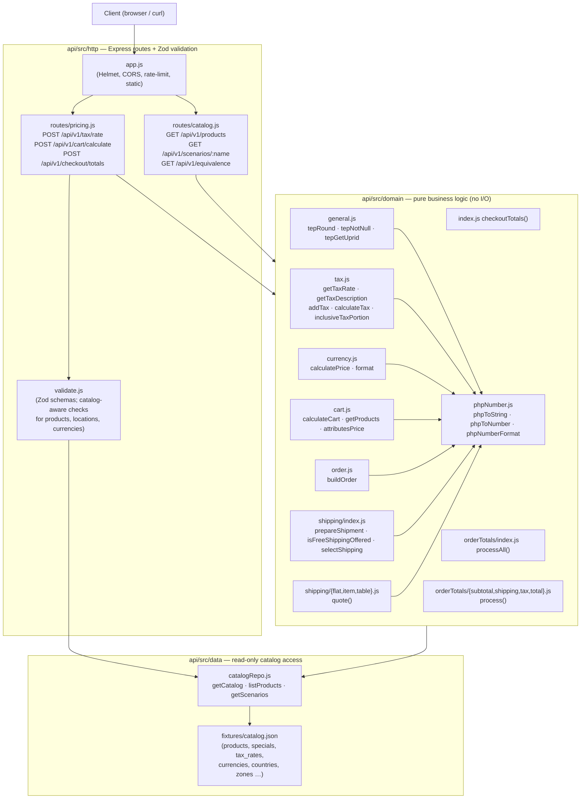

# Modern architecture: CleanCart API

<!-- Filled in by Bob (T10). Check with: npm run check:docs -- --stage modern -->

How the same rules are structured after the modernization.

## Overview

CleanCart is a stateless Node.js REST API (Express 4) that reimplements the checkout pricing
math of osCommerce v2.3.4 as a pure computation service. Given a cart, a delivery address and a
shipping configuration it returns every intermediate value the legacy storefront produced —
cart totals, shipment boxes, shipping quote, order subtotals, tax lines and the formatted order
total — bit-for-bit identical to the legacy PHP output.

**What it deliberately does not do:**

- **No sessions.** The legacy storefront stored the cart and the selected shipping method in
  PHP `$_SESSION`. The API is fully stateless: every request carries the complete inputs.
- **No database writes.** The legacy code wrote orders, session records and stock updates.
  The API is read-only; it answers pricing questions only.
- **No HTML rendering.** The legacy pages mixed pricing logic with Smarty/PHP HTML output.
  The API returns JSON; the React demo UI in `api/public/` renders it.
- **No SQL.** Catalog data (products, specials, tax rates, currencies, countries, zones) is
  served from `fixtures/catalog.json` through `api/src/data/catalogRepo.js`. Swapping in a
  real database only requires replacing that one module.

**Deployment:** the service runs on Render (see `render.yaml`). `GET /health` returns
`{ status: "ok" }`. Interactive docs are at `/docs` (Swagger UI over `api/openapi.yaml`).
A live equivalence report is at `GET /api/v1/equivalence`.

## Layers



**HTTP layer** (`api/src/http/`): Express middlewares handle cross-cutting concerns (Helmet
security headers, CORS, rate-limiting at 600 req/15 min). `validate.js` uses Zod schemas to
parse and catalog-validate every request body before a domain function is ever called, so the
domain layer only ever sees well-formed integers, known product IDs, valid currency codes, and
real country/zone pairs.

**Domain layer** (`api/src/domain/`): pure functions with no I/O. Each module corresponds to
one legacy PHP file or class. `phpNumber.js` supplies the three PHP 7.4 numeric-conversion
helpers (`phpToString`, `phpToNumber`, `phpNumberFormat`) used wherever the legacy code relied
on PHP's implicit type coercions. `index.js` assembles the pipeline in the same page-execution
order as the storefront.

**Data layer** (`api/src/data/`): `catalogRepo.js` exposes `getCatalog()` (deep-frozen singleton
from `fixtures/catalog.json`), `listProducts()`, `getScenario()` and `getScenarios()`. The
domain layer receives the catalog as a plain argument; it never calls `require` on the data
layer itself, keeping the domain modules easily unit-testable.

## Legacy to modern mapping

| Legacy function / page | Modern module and function | Business rules |
|---|---|---|
| `general.php` `tep_round($n, $prec)` lines 305–323 | [`general.js` `tepRound()`](../api/src/domain/general.js:41) | BR-01, Q-01, Q-02 |
| `general.php` `tep_not_null($v)` lines 1167–1181 | [`general.js` `tepNotNull()`](../api/src/domain/general.js:91) | (utility used by OT filter) |
| `general.php` `tep_get_uprid($prid, $params)` lines 943–990 | [`general.js` `tepGetUprid()`](../api/src/domain/general.js:138) | (cart key builder) |
| `general.php` `tep_get_tax_rate($class, $country, $zone)` lines 328–357 | [`tax.js` `getTaxRate()`](../api/src/domain/tax.js:95) | BR-02, BR-03, BR-04 |
| `general.php` `tep_get_tax_description($class, $country, $zone)` lines 362–381 | [`tax.js` `getTaxDescription()`](../api/src/domain/tax.js:136) | BR-04, Q-09 |
| `general.php` `tep_add_tax($price, $tax)` lines 385–391 | [`tax.js` `addTax()`](../api/src/domain/tax.js:164) | BR-05 |
| `general.php` `tep_calculate_tax($price, $tax)` lines 394–396 | [`tax.js` `calculateTax()`](../api/src/domain/tax.js:181) | BR-06 |
| `classes/order.php` line 318 (inclusive divisor) | [`tax.js` `inclusiveTaxPortion()`](../api/src/domain/tax.js:203) | BR-16, Q-06 |
| `classes/currencies.php` `calculate_price()` line 50 | [`currency.js` `calculatePrice()`](../api/src/domain/currency.js:33) | BR-07, Q-03, Q-10 |
| `classes/currencies.php` `format()` lines 35–48 | [`currency.js` `format()`](../api/src/domain/currency.js:59) | BR-08 |
| `classes/shopping_cart.php` `attributes_price()` lines 306–323 | [`cart.js` `attributesPrice()`](../api/src/domain/cart.js:59) | BR-11 |
| `classes/shopping_cart.php` `get_products()` lines 325–358 | [`cart.js` `getProducts()`](../api/src/domain/cart.js:100) | BR-12, Q-08 |
| `classes/shopping_cart.php` `calculate()` lines 261–304 and `count_contents()` lines 203–213 | [`cart.js` `calculateCart()`](../api/src/domain/cart.js:162) | BR-09, BR-10, Q-04, Q-05, Q-08 |
| `classes/order.php` `cart()` lines 281–341 | [`order.js` `buildOrder()`](../api/src/domain/order.js:46) | BR-13, BR-14, BR-15, BR-16, BR-17, Q-04, Q-06, Q-09 |
| `classes/shipping.php` lines 50–62 | [`shipping/index.js` `prepareShipment()`](../api/src/domain/shipping/index.js:37) | BR-18 |
| `checkout_shipping.php` lines 73–100 (free-shipping offer) | [`shipping/index.js` `isFreeShippingOffered()`](../api/src/domain/shipping/index.js:74) | BR-23 |
| `checkout_shipping.php` lines 115–129 (session `$shipping`) | [`shipping/index.js` `selectShipping()`](../api/src/domain/shipping/index.js:110) | BR-23 |
| `modules/shipping/flat.php` lines 48–64 | [`shipping/flat.js` `quote()`](../api/src/domain/shipping/flat.js:30) | BR-19, BR-22 |
| `modules/shipping/item.php` lines 48–66 | [`shipping/item.js` `quote()`](../api/src/domain/shipping/item.js:34) | BR-20, BR-22 |
| `modules/shipping/table.php` lines 48–83 | [`shipping/table.js` `quote()`](../api/src/domain/shipping/table.js:45) | BR-21, BR-22, Q-05 |
| `classes/order_total.php` `process()` lines 34–57 | [`orderTotals/index.js` `processAll()`](../api/src/domain/orderTotals/index.js:36) | BR-28 |
| `modules/order_total/ot_subtotal.php` lines 26–31 | [`orderTotals/subtotal.js` `process()`](../api/src/domain/orderTotals/subtotal.js:27) | BR-26 |
| `modules/order_total/ot_shipping.php` lines 26–65 | [`orderTotals/shipping.js` `process()`](../api/src/domain/orderTotals/shipping.js:50) | BR-24, BR-25, Q-07 |
| `modules/order_total/ot_tax.php` lines 26–35 | [`orderTotals/tax.js` `process()`](../api/src/domain/orderTotals/tax.js:27) | BR-27, Q-09 |
| `modules/order_total/ot_total.php` lines 26–31 | [`orderTotals/total.js` `process()`](../api/src/domain/orderTotals/total.js:27) | BR-26 |

## How equivalence is proven

Equivalence is enforced at four interlocking levels:

### 1. Golden fixtures (`fixtures/golden/`)

The `fixtures/golden/` directory contains JSON files recorded by running the unmodified
osCommerce PHP (v2.3.4, git `329d51a`) through the PHP 7.4 WebAssembly harness in
`legacy-harness/`. There are two kinds:

- **Function fixtures** (`fixtures/golden/functions/*.json`): each file tests one PHP function
  with a battery of inputs and their exact PHP-produced outputs. For example
  `fixtures/golden/functions/tep_round.json` records that `tep_round(1.005, 2)` returns `"1.01"`
  and `tep_round(2.675, 2)` returns `"2.68"`. These drive the `T3`–`T5` checks.
- **Scenario fixtures** (`fixtures/golden/scenarios/*.json`): each file is a complete checkout
  with its input (`scenario`) and every intermediate value the legacy code produced (`expected`).
  For example `fixtures/golden/scenarios/us-fl-basic-flat.json` records that Florida, 7 % tax,
  product 1 (qty 2, two `+` attributes, special price $299.99) + product 3 (qty 1) with flat
  shipping $5.00 gives `cart.total = "939.97"`, tax `"65.7979"` and formatted total
  `"<strong>$1,010.77</strong>"`. The 20 `random-20260929-*` files are a hold-out set (see
  below). The fixtures are the specification — if the modern code disagrees with a fixture, the
  code is wrong.

### 2. `phpNumber.js` — PHP type-coercion bridge

[`api/src/domain/phpNumber.js`](../api/src/domain/phpNumber.js) reproduces three PHP 7.4
behaviours that JavaScript does not share:

- **`phpToString(x)`**: PHP's `(string)$float` with `precision=14` (14-significant-digit `%G`
  format). Used wherever legacy code does string concatenation or `strpos/substr/str_replace` on
  a number (e.g. `tep_round` rounds the *string* form of the price, and `inclusiveTaxPortion`
  builds the divisor by string concatenation).
- **`phpToNumber(x)`**: PHP's leading-numeric-prefix coercion (`"299.9900"` → `299.99`,
  `"abc"` → `0`). Used wherever PHP arithmetic operates on a DB string or on the last character
  of a truncated price string.
- **`phpNumberFormat(n, dec, decPt, sep)`**: PHP `number_format()` with half-up rounding and
  exact `printf("%.*F")` decimal expansion. Used by `currency.js` `format()` to format every
  displayed price.

Each helper is independently verified by the `fixtures/golden/functions/php_*.json` fixtures.

### 3. Staged checks (`api/src/verify/checks.js`)

[`api/src/verify/checks.js`](../api/src/verify/checks.js) defines a list of checks, one per
function group or scenario stage:

| Check id | Module | What it tests |
|---|---|---|
| `tep_round` | general | `tepRound()` against `fixtures/golden/functions/tep_round.json` |
| `tax_rate` | tax | `getTaxRate()` against `fixtures/golden/functions/tax_rate.json` |
| `tax_description` | tax | `getTaxDescription()` against `fixtures/golden/functions/tax_description.json` |
| `add_tax` | tax | `addTax()` against `fixtures/golden/functions/add_tax.json` |
| `calculate_tax` | tax | `calculateTax()` against `fixtures/golden/functions/calculate_tax.json` |
| `inclusive_tax` | tax | `inclusiveTaxPortion()` against `fixtures/golden/functions/inclusive_tax.json` |
| `calculate_price` | currency | `calculatePrice()` against `fixtures/golden/functions/calculate_price.json` |
| `format` | currency | `format()` against `fixtures/golden/functions/format.json` |
| `cart_calculate` | cart | `calculateCart()` against `fixtures/golden/functions/cart_calculate.json` |
| `scenario_cart` | cart | cart stage of every golden scenario |
| `scenario_order` | order | order before/after shipping of every golden scenario |
| `scenario_shipping` | shipping | shipment, free-shipping offer, quote, selection of every scenario |
| `scenario_order_totals` | ot | order totals lines and final `order.info` of every scenario |
| `scenario_pipeline` | pipeline | full `checkoutTotals()` end-to-end vs. every golden scenario |

Each check runs per-module with `npm run check:<module>` (e.g. `npm run check:tax`), or all at
once with `npm run verify`. A failing case prints the input, the legacy value and the modern
value side by side.

### 4. Hold-out set and live equivalence endpoint

The 20 `fixtures/golden/scenarios/random-20260929-*.json` fixtures were generated with a fixed
random seed **after** the translation was complete; they were never seen during development.
`npm run holdout` runs only these scenarios and fails if any differ from the legacy output,
providing an independent check against overfitting.

The live API exposes all checks at **`GET /api/v1/equivalence`**, which runs `runAll()` from
`checks.js` against the running server's catalog and returns a JSON report:

```json
{
  "equivalent": true,
  "cases": 1234,
  "passed": 1234,
  "durationMs": 210,
  "modules": [
    { "module": "general", "task": "T3", "implemented": true, "passed": 12, "total": 12 },
    ...
  ]
}
```

## Extending the API

### Adding a new business rule

1. Add the rule to `docs/business-rules.md` with a `BR-nn` id, citing the legacy file and line.
2. Implement the function in the appropriate domain module (`api/src/domain/`). Keep it pure
   (no I/O, no side effects). Use `phpToString`/`phpToNumber`/`phpNumberFormat` wherever PHP
   implicit type conversion is involved.
3. Export the function and add it to the imports in `api/src/domain/index.js` if it is part of
   the checkout pipeline.
4. Add a golden fixture (or extend an existing scenario) that records the expected output from
   the real legacy PHP, add a check entry in `api/src/verify/checks.js`, and add a unit test in
   `api/test/unit/` with the `BR-nn` id in the test name.
5. Run `npm run check:<module>` until it passes, then `npm run verify`.

### Fixing a quirk behind a `corrected` flag

The ten legacy quirks (Q-01–Q-10) are intentionally preserved because the golden fixtures are
the specification. To offer a "corrected" computation mode without breaking equivalence:

1. Add `"corrected": true` as an optional boolean field in the `settings` Zod schema in
   `api/src/http/validate.js` (default `false`).
2. Thread the flag through `resolveSettings()` in `api/src/domain/index.js` into
   `PricingContext`.
3. In the affected domain function (e.g. `tepRound` for Q-01/Q-02, `calculatePrice` for Q-03,
   `inclusiveTaxPortion` for Q-06), guard the corrected path with
   `if (ctx.corrected) { /* mathematically correct code */ } else { /* legacy path */ }`.
4. Add a second set of golden fixtures labelled `corrected-*` to a separate directory (e.g.
   `fixtures/golden-corrected/`) so the equivalence checks for the legacy path are not affected.
5. **Never** change the default path: `npm run verify` must still pass with all original
   fixtures/golden/ unchanged.

### Adding a new shipping module

1. Create `api/src/domain/shipping/<name>.js` exporting a `quote(ctx)` function that follows the
   same signature as `flat.js`, `item.js` and `table.js`.
2. Register it in `SHIPPING_MODULES` in `api/src/domain/index.js`.
3. Add the new `module` literal to the discriminated union in `api/src/http/validate.js`.
4. Record scenario fixtures and add a `scenario_shipping` check entry.
